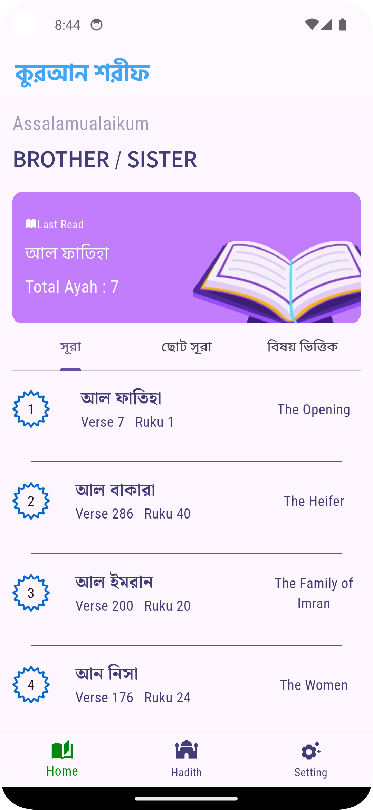
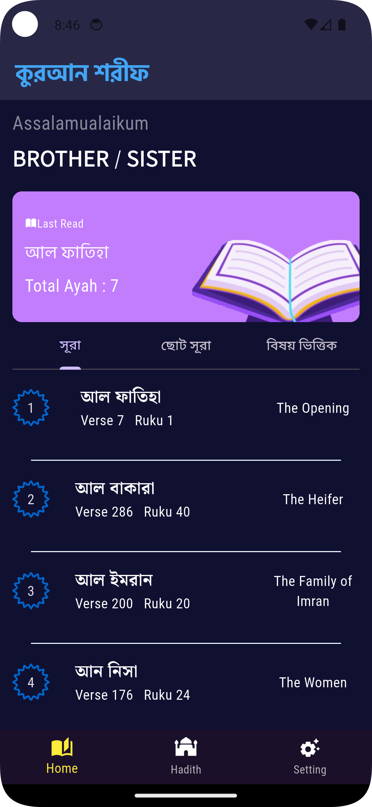
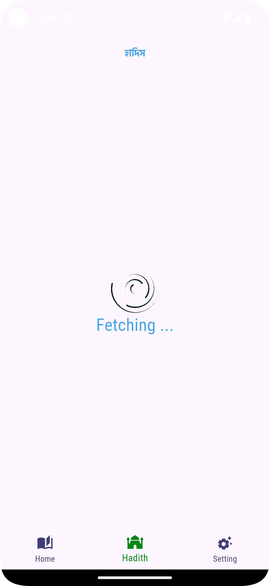
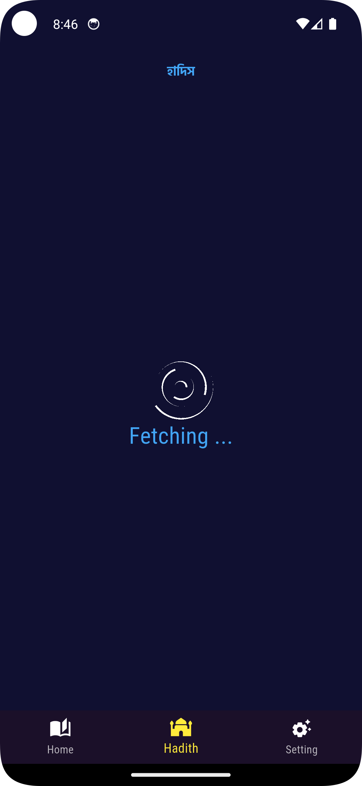
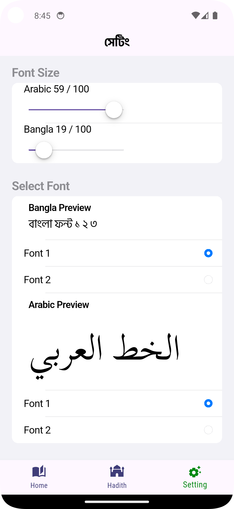
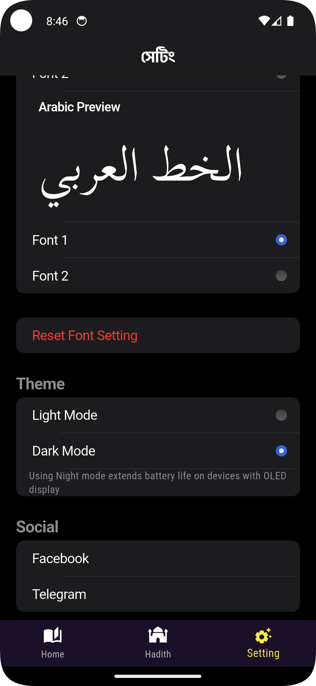
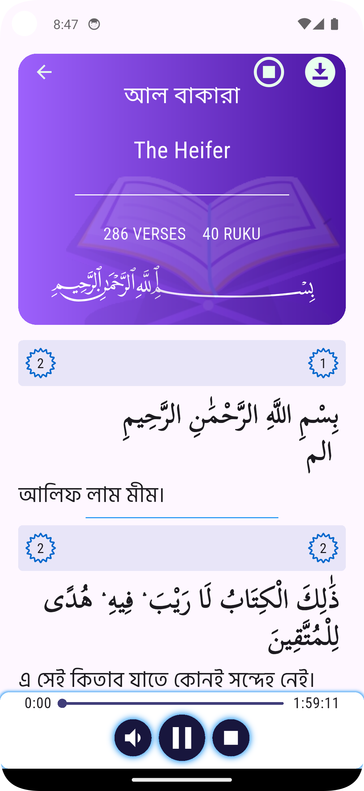
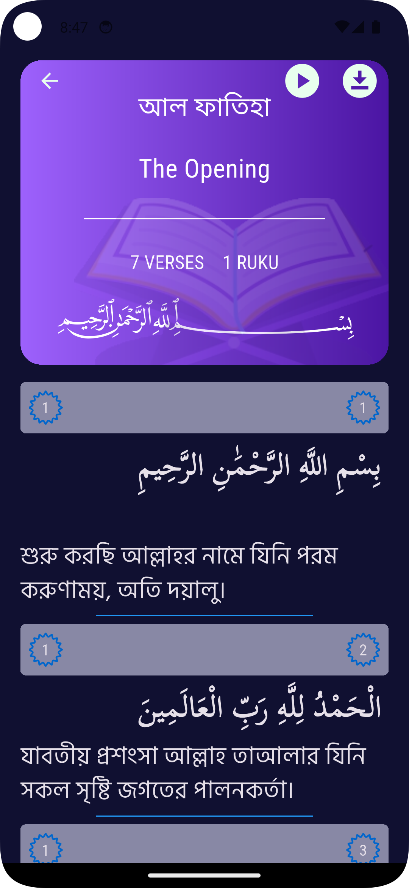

# 📖 QuranBangla

**QuranBangla** is a beautifully designed, Flutter-powered application that brings the Holy Quran and Hadith collections to life in both Bengali and Arabic. Built with a focus on offline functionality and elegant UI/UX, it offers a seamless and customizable reading experience.
This app represents my first large-scale Flutter project (developed during 2021–2022) and a major step in my growth as a developer.

---

## 📸 Screenshots

<table> <tr> <td></td> <td></td> <td></td> <td></td> </tr> <tr> <td></td> <td></td> <td></td> <td></td> </tr> </table>

---

## 📅 Project Status (2021–2022 Release)

> 🚧 **Note:** This project was initially built with Flutter during 2021–2022. Some features may be outdated due to dependency changes and external service deprecation.

* ✅ Quran reading features are stable and fully offline.
* ❌ Hadith section is **temporarily unavailable** due to the shutdown of the external API service.
* 🔄 Planned updates include a full UI overhaul, Flutter 3+ support, and new Hadith data integration.

---

## ✨ Features

* 📘 **Full Quran in Arabic & Bengali** (offline with SQLite)
* 🔢 **Surah & Para Navigation** – Easy access to any chapter or section
* 🔠 **Customizable Font Sizes** – Independently control Arabic and Bengali font sizes
* 🖋️ **Multiple Font Choices** – Choose from fonts like `ScheherazadeNew`, `Amiri`, `HindSiliguri`, and `Noto Serif`
* 🌗 **Dark & Light Modes** – Comfortable reading in any lighting
* 🔊 **Quran Audio Playback** – With `just_audio` and full background support
* 📍 **Last Read Memory** – Automatically resumes where you left off
* 📚 **Hadith Section** – Currently offline, being reworked
* 🌐 **Connectivity Check** – Smart detection for online-required features
* 🖥️ **Multi-Platform Support** – Android, iOS, Web, Linux, Windows

---

## 🛠 State Management

QuranBangla uses a hybrid approach for efficient and reactive state handling:

* **Provider**: App-wide theme, font settings, and shared state
* **GetX**: Controllers, dependency injection, routing, and reactive UI

---

## 🧰 Tech Stack

| Technology                                    | Purpose                                     |
| --------------------------------------------- | ------------------------------------------- |
| **Flutter**                                   | Cross-platform app development              |
| **Dart**                                      | Programming language                        |
| **sqflite**                                   | Local SQLite database for Quran data        |
| **just\_audio** / **just\_audio\_background** | Audio playback with background support      |
| **provider**                                  | Lightweight state management                |
| **get**                                       | Reactive state management, routing          |
| **shared\_preferences**                       | Saving user settings locally                |
| **connectivity\_plus**                        | Network status monitoring                   |
| **lottie**                                    | Engaging animations (e.g., for no internet) |

---

## 🚀 Getting Started

Clone and run the app in a few easy steps:

```bash
git clone [your-repo-link]
cd quranbangla
flutter pub get
flutter run
```

> 📱 Best experience is on Android/iOS devices. Web support is experimental and may not render Arabic text correctly.

---

## 🌱 Roadmap & Future Plans

Here’s what’s next for QuranBangla:

* 🎨 **Modern UI Refresh** – Redesigned with better theming and layout
* 🧩 **Hadith Section Rework** – Integrate a new API or local DB for offline use
* 🛠️ **Gradle & Flutter Updates** – Align with latest tools and best practices
* ⚡ **Performance Improvements** – Optimize rendering and state management
* 🐞 **Bug Fixes & Testing** – Polish user experience across platforms

---

## 💬 Final Words

This project means a lot to me — not just as a devotional resource, but as a major stepping stone in my Flutter development journey. I hope you find **QuranBangla** as useful and inspiring as I found building it.

> ✨ *Built with love, learning, and dedication.*

---
